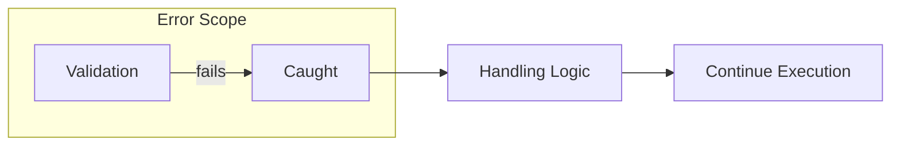
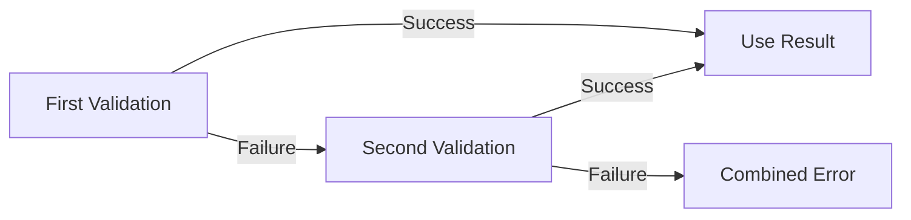
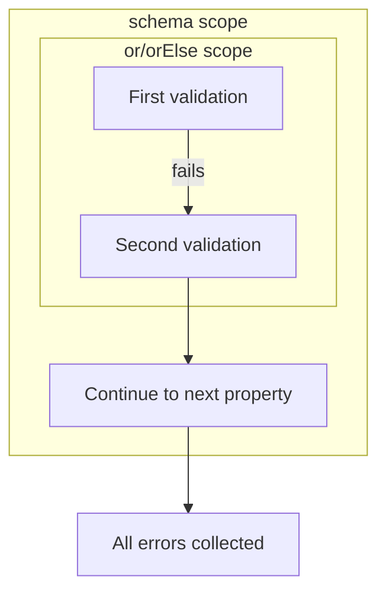

# Error Accumulation in Kova

## Overview

When validation fails, Kova doesn't stop immediately. Instead, it collects the error and continues validating the remaining constraints. This **error accumulation** behavior allows users to see all validation errors at once, rather than fixing them one by one.

This document explains how Kova achieves this through **error scopes**—isolated boundaries where validation errors are caught and collected.

See also:
- [Available Validators](VALIDATORS.md) - Complete list of built-in validators
- [Advanced Topics](ADVANCED.md) - Custom constraints, conditional validation, and more

## How Error Scoping Works

Kova creates **error scopes** internally when you use `schema`, `constrain`, `capture`, or `or`/`orElse`. When a validation fails inside a scope, the failure is caught and handled locally instead of propagating upward.



The key insight is that **scopes are independent**. A failure in an inner scope doesn't affect the outer scope, allowing fine-grained control over error handling.

## Error Scoping in Practice

### Collecting All Errors

`schema`, `constrain`, and `capture` each create error scopes to collect all errors:

```kotlin
context(_: Validation)
fun User.validate() = schema {
    ::name { it.ensureNotBlank() }     // Error scope 1
    ::age { it.ensureAtLeast(0) }      // Error scope 2
    ::email { it.ensureEmail() }       // Error scope 3
}
```

If `name` validation fails, the error is caught and validation continues to `age` and `email`.

```kotlin
input
    .constrain("first") { /* ... */ }   // Error scope 1
    .constrain("second") { /* ... */ }  // Error scope 2
```

Method chaining continues even when earlier constraints fail.

```kotlin
context(_: Validation)
fun buildUser(rawName: String, rawAge: String): User {
    val name by capture { rawName.ensureNotBlank() }       // Error scope 1
    val age by capture { rawAge.transformToInt() }         // Error scope 2
    return User(name, age)
}
```

If `name` validation fails, validation continues to `age`.

### Trying Alternatives

`or` and `orElse` create error scopes to try alternative validations:

```kotlin
tryValidate {
    // Accept values that are either >= 100 OR <= 10
    val value = or { input.ensureAtLeast(100) } orElse { input.ensureAtMost(10) }
}
```



| First | Second | Result |
|-------|--------|--------|
| Success | — | `Success(value)` |
| Failure | Success | `Success(value)` |
| Failure | Failure | `Failure(combined messages)` |

## Nested Scopes

Scopes can be nested, and each scope handles its own errors independently. For example, when using `or` inside a `schema`:

```kotlin
data class Config(val value: Int, val other: Int)

context(_: Validation)
fun Config.validate() = schema {
    ::value {
        // Inner scope: try alternatives
        or { it.ensureAtLeast(100) } orElse { it.ensureAtMost(10) }
    }
    ::other { it.ensurePositive() }  // Continues regardless of above result
}
```



## Scope Identification

Kova uses **object identity** internally to match errors with their scopes. Each scope creates a unique error instance, ensuring that:

- Errors are handled by the correct scope
- Nested scopes don't interfere with each other
- Unhandled errors propagate to outer scopes

This is why you can safely nest `or`/`orElse` calls within `schema` blocks without worrying about scope confusion.

## Summary

Kova's error accumulation is built on **error scopes**:

| Feature         | Creates Error Scope | Purpose                                     |
|-----------------|---------------------|---------------------------------------------|
| `schema`        | Per property        | Validate all properties, collect all errors |
| `constrain`     | Per constraint      | Chain constraints, continue on failure      |
| `capture`       | Per delegation      | Validate arguments, collect all errors      |
| `or` / `orElse` | Per alternative     | Try fallback when first validation fails    |

Scopes are independent and can be nested safely, enabling flexible validation logic while ensuring all errors are reported to the user.
