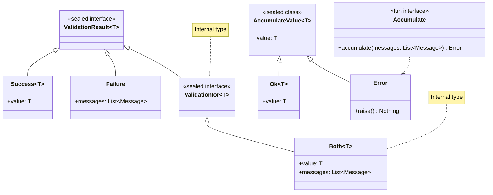
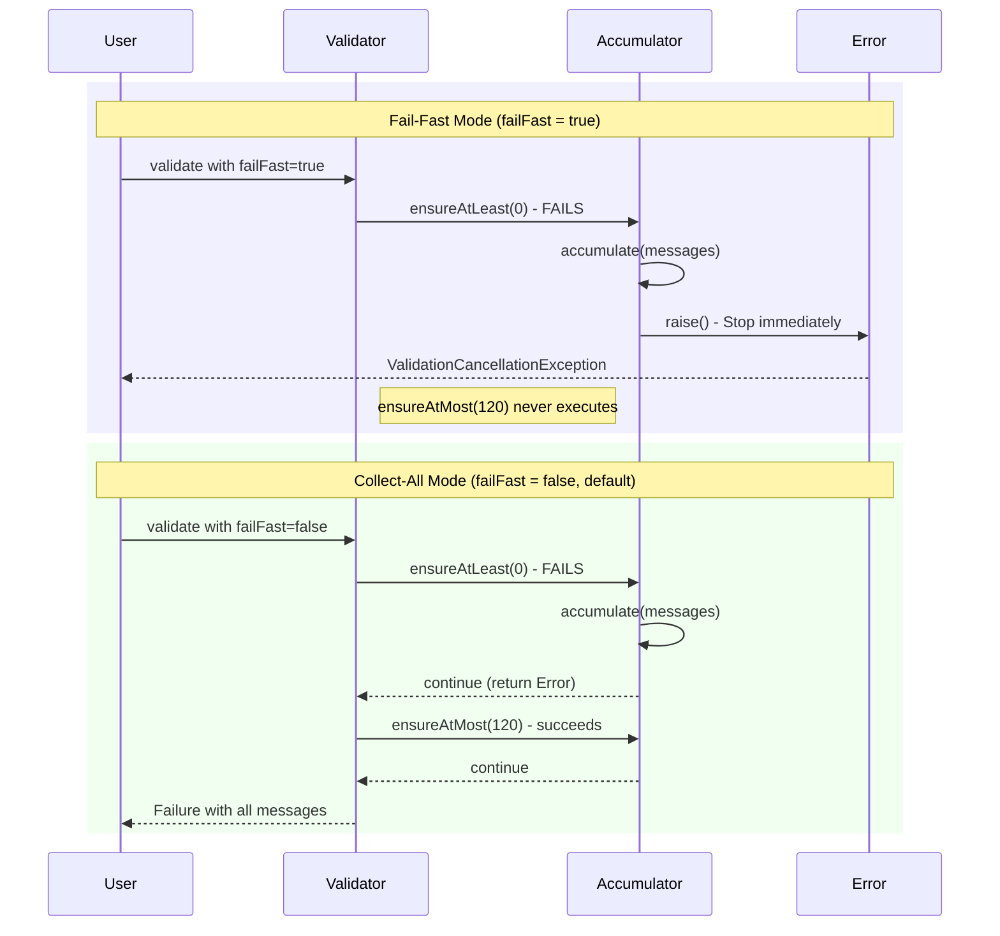
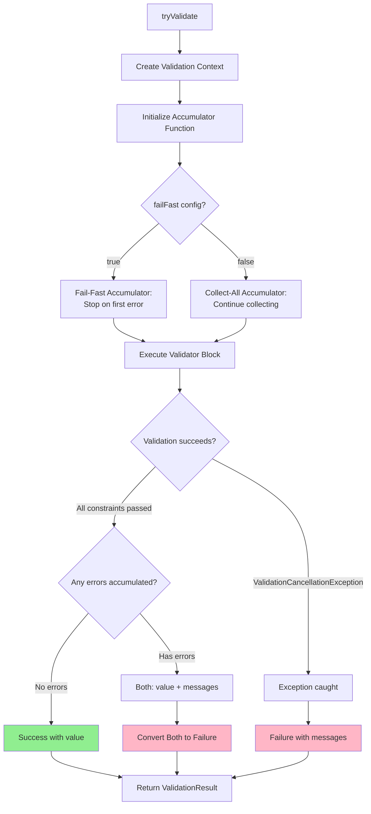
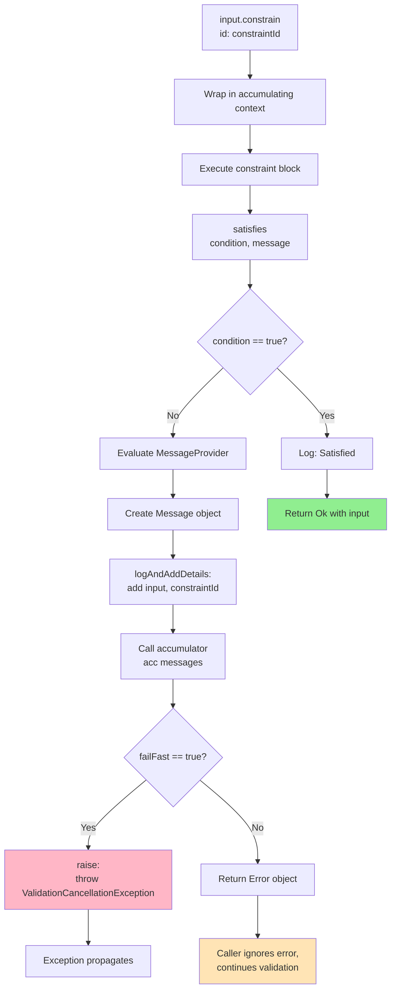
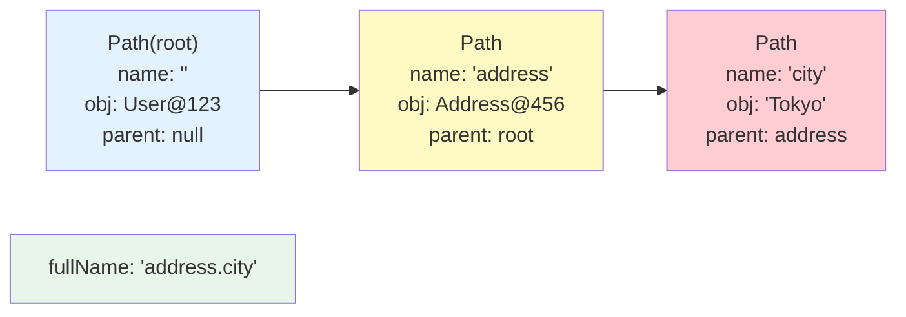
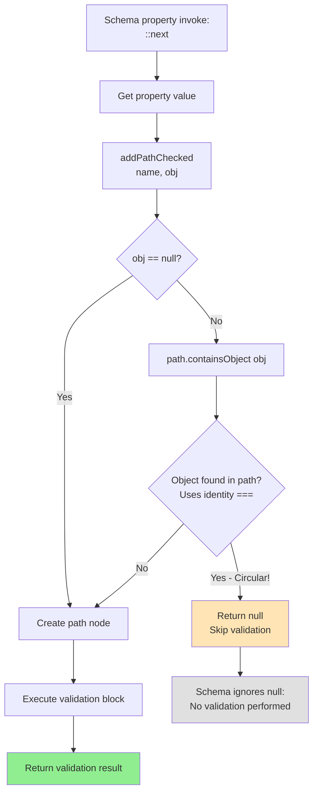
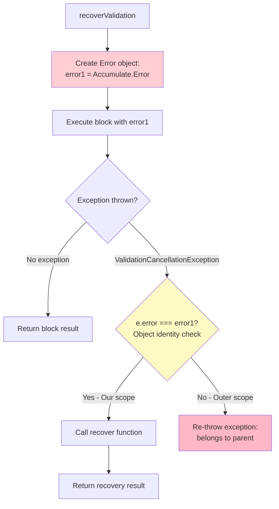

# Error Accumulation in Kova

## Overview

Kova provides a sophisticated error accumulation system that collects validation errors throughout the validation process. Understanding how errors are accumulated, tracked, and reported is essential for effective debugging and building robust validation logic.

This document explains:
- How validation errors are collected (fail-fast vs collect-all modes)
- The internal mechanisms for error tracking and path management
- How to interpret error messages and debug validation issues

See also:
- [Available Validators](VALIDATORS.md) - Complete list of built-in validators
- [Advanced Topics](ADVANCED.md) - Custom constraints, conditional validation, and more

## Core Concepts

### Type Hierarchy

Kova uses a hierarchy of types to represent validation results and manage error accumulation:



**Key Types**:

- **`ValidationResult<T>`**: Public result type returned by `tryValidate()`
  - `Success<T>`: Validation succeeded, contains the validated value
  - `Failure`: Validation failed, contains error messages

- **`ValidationIor<T>`**: Internal result type that includes partial success
  - `Both<T>`: Contains both a value and error messages (converted to `Failure` when returned to user)

- **`Accumulate`**: Functional interface that defines the error accumulation strategy
  - Receives error messages and decides whether to fail-fast or continue

- **`Accumulate.Value<T>`**: Represents the result of a constraint validation
  - `Ok<T>`: Constraint satisfied
  - `Error`: Constraint violated

### Message Structure

Every validation error is represented as a `Message` object with detailed information:

```kotlin
sealed interface Message {
    val text: String              // Human-readable error message
    val constraintId: String       // Constraint identifier (e.g., "kova.string.notBlank")
    val root: String               // Validation root name (e.g., "User")
    val path: Path                 // Property path within root
    val input: Any?                // The value that failed validation
    val args: List<Any?>           // Arguments passed to the constraint
    val descendants: List<Message> // Nested error messages
}
```

**Message Properties Explained**:

- **`constraintId`**: Identifies which constraint failed (e.g., `"kova.string.notBlank"`, `"kova.number.atLeast"`)
- **`root`**: The name of the validation root—typically the type being validated (e.g., `"User"`, `"Address"`)
- **`path`**: The property path from the root to the failed value (e.g., `"name"`, `"address.city"`)
- **`input`**: The actual value that failed validation
- **`args`**: Parameters used in the constraint (e.g., minimum length, expected range)
- **`text`**: The formatted error message for display to users
- **`descendants`**: Nested messages for composite constraints (e.g., `or` constraints)

### Understanding `root` vs `path`

The `root` and `path` properties work together to identify where a validation error occurred:

```kotlin
data class Address(val city: String)
data class User(val name: String, val address: Address)

context(_: Validation)
fun Address.validate() = schema {  // Sets root = "Address" (if not already set)
    ::city { it.ensureNotBlank() }
}

context(_: Validation)
fun User.validate() = schema {  // Sets root = "User"
    ::name { it.ensureNotBlank() }     // root="User", path="name"
    ::address { it.validate() }        // root="User" (preserved), path="address.city"
}

val result = tryValidate { User("", Address("")).validate() }
// All messages have root="User" even for nested Address validation
```

**Key Insight**: The `root` is set once at the top-level `schema` call and remains constant throughout all nested validations. This helps identify which validation entry point produced the error.

When you validate `User`, all errors—even those from nested `Address` validation—have `root="User"`. The `path` property tracks the location within that root:
- `path="name"` for the user's name
- `path="address.city"` for the nested city property

## Fail-Fast vs Collect-All Modes

Kova supports two error accumulation modes controlled by `ValidationConfig.failFast`:

| Mode | Behavior | Use Case |
|------|----------|----------|
| **Collect-All** (default, `failFast = false`) | Collects all validation errors | Form validation, user-facing errors—show all issues at once |
| **Fail-Fast** (`failFast = true`) | Stops at first error | API validation, early termination—quick failure detection |

### Behavior Comparison



### Code Example

```kotlin
// Collect-All Mode (default) - Collects all errors
val result1 = tryValidate {
    val age = -1
    age.ensureAtLeast(0)   // Fails - error collected
    age.ensureAtMost(120)  // Still executes and passes
}
// Result: Failure with 1 message (ensureAtLeast)

// Fail-Fast Mode - Stops at first error
val result2 = tryValidate(ValidationConfig(failFast = true)) {
    val age = -1
    age.ensureAtLeast(0)   // Fails - stops immediately
    age.ensureAtMost(120)  // Never executed
}
// Result: Failure with 1 message (ensureAtLeast)
```

### When to Use Each Mode

**Collect-All (default)**:
- Form validation where users need to see all errors at once
- Data import validation to report all issues in a batch
- API request validation when you want comprehensive error reporting

**Fail-Fast**:
- Quick validation checks where the first error is sufficient
- Performance-critical paths where you want to minimize constraint evaluations
- Large object graphs where continuing after an error is wasteful

### Special Case: Validators that Always Raise Immediately

Some validators always raise immediately when they fail, **regardless of the `failFast` setting**. These validators use `.raise()` internally, which throws `ValidationCancellationException` immediately, stopping all subsequent validation.

**Validators that always raise immediately**:

1. **`ensureNotNull()`** - Raises immediately when the input is `null`
2. **Transform functions** - Raise immediately when conversion fails:
   - `transformToInt()` - Raises if string cannot be parsed as Int
   - `transformToLong()` - Raises if string cannot be parsed as Long
   - `transformToShort()`, `transformToByte()`, `transformToDouble()`, `transformToFloat()`
   - `transformToBigDecimal()`, `transformToBigInteger()`
   - `transformToBoolean()` - Raises if string is not "true" or "false"
   - `transformToEnum<T>()` - Raises if string doesn't match any enum constant

**Why this behavior?**

These validators enable **smart casting** and **type transformation**. When `ensureNotNull()` succeeds, Kotlin's compiler knows the value is non-null. When `transformToInt()` succeeds, you have a guaranteed `Int` value. If validation continued after failure, the type system would be violated.

**Code Example**:

```kotlin
// ensureNotNull always raises immediately on null
val result1 = tryValidate {
    val name: String? = null
    name.ensureNotNull()        // Raises immediately, even in collect-all mode
    name.ensureLengthAtLeast(3) // Never executed - name is null
}
// Result: Failure with 1 message (kova.nullable.notNull)

// transformToInt always raises immediately on conversion failure
val result2 = tryValidate {
    val input = "abc"
    val number = input.transformToInt()  // Raises immediately - "abc" is not a valid Int
    number.ensureAtLeast(0)              // Never executed
}
// Result: Failure with 1 message (kova.string.int)

// Successful transformation enables smart casting
val result3 = tryValidate {
    val input = "42"
    val number = input.transformToInt()  // Success: number is Int (not String)
    number.ensureAtLeast(0)              // Executes - number is guaranteed to be Int
}
// Result: Success(42)
```

**Important**: Even in collect-all mode (`failFast = false`), these validators stop validation immediately upon failure. This is different from regular validators which continue accumulating errors.

**Comparison with Regular Validators**:

```kotlin
// Regular validators respect failFast setting
tryValidate(ValidationConfig(failFast = false)) {
    val age = -1
    age.ensureAtLeast(0)   // Fails, but continues
    age.ensureAtMost(120)  // Still executes
}
// Result: Failure with 1 message (ensureAtLeast - ensureAtMost passed)

// ensureNotNull ignores failFast setting
tryValidate(ValidationConfig(failFast = false)) {
    val name: String? = null
    name.ensureNotNull()        // Raises immediately, stops validation
    name.ensureLengthAtLeast(3) // Never executed
}
// Result: Failure with 1 message (kova.nullable.notNull)
```

This design ensures type safety while providing a predictable validation flow.

## Error Accumulation Flow

### High-Level Flow



The validation process follows these steps:

1. **Entry**: `tryValidate()` creates a `Validation` context with configuration
2. **Accumulator Setup**: Creates an accumulator function based on `failFast` setting
3. **Execution**: Runs the validator block with the configured context
4. **Error Collection**: Each constraint violation calls the accumulator
5. **Result**: Returns `Success` if no errors, otherwise `Failure`

### Constraint Validation Flow



**How Constraint Validation Works**:

1. **`constrain(id)`**: Wraps the constraint check in an accumulating context
2. **`satisfies(condition)`**: Evaluates the validation condition
3. **Message Creation**: If condition fails, evaluates the message provider
4. **Enrichment**: Adds constraint ID, input value, and path to the message
5. **Accumulation**: Calls the accumulator function with the message
6. **Decision Point**: Accumulator decides to fail-fast or continue based on config

### Code Example

```kotlin
// What happens when you validate
tryValidate {  // Creates Validation context
    "abc"
        .ensureLengthAtLeast(5)      // constrain → satisfies → accumulate → continue
        .ensureMatches(Regex("\\d+")) // constrain → satisfies → accumulate → continue
}
// Both constraints fail
// Result: Both(value="abc", messages=[length error, pattern error])
// Converted to: Failure(messages=[length error, pattern error])
```

Internally, each `ensure*` method:
1. Calls `constrain("constraint.id")`
2. Evaluates the condition with `satisfies()`
3. If failed, creates a message and accumulates it
4. Returns `Accumulate.Value` (either `Ok` or `Error`)

## Path Tracking and Nested Validation

Kova tracks the location of validation errors using a linked list of `Path` nodes. Each path node records a property name and object reference, forming a chain from the root to the specific property that failed.

### Path Structure



**Path Properties**:
- **`name`**: The property name (e.g., `"address"`, `"city"`)
- **`obj`**: Object reference for circular reference detection
- **`parent`**: Link to parent path node (forms linked list)
- **`fullName`**: Computed property path (e.g., `"address.city"`)

The `Validation` context also stores:
- **`root`**: The validation root name (set once, never changes)

### How `root` is Initialized

The `root` property is set by the `schema` function using `addRoot()`:

1. **First `schema` call**: Sets `root` to the type name (e.g., `"User"`)
2. **Nested `schema` calls**: Preserve the original `root` value
3. **Purpose**: Identifies which validation entry point produced the error

This design means all errors in a validation session share the same `root`, while their `path` values differ based on property location.

### Schema Validation with `root` and `path`

```kotlin
data class Address(val city: String, val zipCode: String)
data class User(val name: String, val address: Address)

context(_: Validation)
fun Address.validate() = schema {  // If root not set, sets root="Address"
    ::city { it.ensureNotBlank() }     // root="Address", path="city"
    ::zipCode { it.ensureLength(5) }   // root="Address", path="zipCode"
}

context(_: Validation)
fun User.validate() = schema {  // Sets root="User"
    ::name { it.ensureNotBlank() }     // root="User", path="name"
    ::address { it.validate() }        // root="User" (preserved!), path="address.city"
}

val result = tryValidate {
    User("", Address("", "123")).validate()
}
// Error messages:
// 1. root="User", path="name", constraintId="kova.string.notBlank"
// 2. root="User", path="address.city", constraintId="kova.string.notBlank"
// 3. root="User", path="address.zipCode", constraintId="kova.charSequence.length"
```

Note how `root="User"` for all errors, even those from nested `Address` validation. The `path` property tracks the nested location.

### Multiple Validation Roots

You can have multiple validation roots in a single `tryValidate` block:

```kotlin
val result = tryValidate {
    // First validation root
    User("", Address("", "123")).validate()  // Errors have root="User"

    // Second validation root
    Address("", "456").validate()  // Errors have root="Address"
}
// Messages will have different roots: some "User", some "Address"
```

This is useful when validating multiple independent objects in one validation session.

### Collection Path Tracking

When validating collection elements, Kova automatically tracks indices:

```kotlin
context(_: Validation)
fun validateItems(items: List<Int>) =
    items.ensureEach { it.ensurePositive() }

val result = tryValidate {
    validateItems(listOf(1, -2, 3, -4))
}
// Error paths: "[1]<iterable element>", "[3]<iterable element>"
```

The `ensureEach` validator appends `[index]<iterable element>` to the path for each failing element, making it easy to identify which items failed validation.

## Circular Reference Detection

Kova automatically detects and handles circular references in nested object validation to prevent infinite loops.

### Detection Algorithm



**How It Works**:

1. **Property Access**: Schema's `::property` operator gets the property value
2. **Path Check**: Calls `addPathChecked(name, obj)` to check for circular references
3. **Identity Check**: Traverses the path linked list using object identity (`===`)
4. **Detection**: If the same object instance is found in the path, returns `null`
5. **Skip**: Schema operator ignores `null` results, skipping validation for that property

### Code Example

```kotlin
data class Node(val value: Int, var next: Node?)

context(_: Validation)
fun Node.validate(): Unit = schema {
    ::value { it.ensurePositive() }
    ::next { it?.validate() }  // Circular reference automatically detected
}

val circular = Node(1, null)
circular.next = circular  // Create self-reference

validate { circular.validate() }  // Succeeds - circular ref detected and skipped
```

**Key Points**:

- **Object Identity**: Detection uses `===` (reference equality), not `==` (value equality)
- **Silent Handling**: Circular references are silently skipped—no error is raised
- **Prevention**: Prevents infinite recursion in recursive data structures

## Advanced Topics

### Exception-Based Control Flow

Kova uses exceptions for control flow, not for error reporting. This design enables natural short-circuiting while maintaining functional composition.

**`ValidationCancellationException`**:

```kotlin
class ValidationCancellationException(val error: Accumulate.Error) : CancellationException() {
    override fun fillInStackTrace(): Throwable {
        stackTrace = emptyArray()  // No stack trace for performance
        return this
    }
}
```

**Why `CancellationException`?**

- **Coroutine-Friendly**: Kotlin coroutines don't wrap cancellation exceptions
- **Lightweight**: No stack trace generation—very cheap to create and throw
- **Semantic**: Clear distinction from actual errors

This exception is thrown when `failFast = true` and a constraint fails, or when explicitly raising in error scopes.

### Error Scoping with `recoverValidation`

The `recoverValidation` function creates error scopes using object identity:



**How Error Scoping Works**:

```kotlin
// Simplified internal mechanism
recoverValidation({ Failure(messages) }) {  // Creates Error object for this scope
    validator(
        validation.copy(acc = { msgs ->
            messages.addAll(msgs)
            if (failFast) raise()  // Throws ValidationCancellationException(this)
            this  // Returns Error object
        })
    )
}
// If ValidationCancellationException caught and e.error === this, return Failure
// Otherwise re-throw (belongs to outer scope)
```

**Key Insight**: Each `recoverValidation` scope creates its own `Accumulate.Error` instance. When a `ValidationCancellationException` is caught, object identity (`===`) determines which scope should handle it. This enables nested validation contexts to be independent.

### Message Enrichment Pipeline

Messages flow through several transformation layers before being reported:

1. **Creation**: `"kova.string.lengthAtLeast".resource(minValue)`
2. **Enrichment**: `logAndAddDetails(message, input, constraintId)`
   - Adds `input` value
   - Adds `constraintId`
   - Adds `path` from context
3. **Wrapping**: `withMessage({ custom message })` can wrap multiple errors
4. **Logging**: If logger configured, logs `LogEntry.Violated`

**Example**:

```kotlin
context(_: Validation)
fun String.ensureLengthAtLeast(minValue: Int) = apply {
    constrain("kova.charSequence.lengthAtLeast") {  // Sets constraintId
        satisfies(it.length >= minValue) {
            "kova.charSequence.lengthAtLeast".resource(minValue)  // Creates message
        }
        // logAndAddDetails adds input value and path
    }
}
```

Each layer adds context, producing rich error messages with all necessary debugging information.

## Performance Characteristics

Kova is designed for high performance with minimal allocations.

### Zero-Allocation for Success

When all validations pass:
- **No message objects created**: Messages are only created on constraint failure
- **No exceptions thrown**: Control flow is normal (no exception overhead)
- **Only logging**: If a logger is configured, `LogEntry.Satisfied` events are logged

This makes successful validation extremely fast.

### Minimal-Allocation for Failure

When validations fail:
- **Message objects only**: Only failed constraints create messages
- **No stack traces**: `ValidationCancellationException` doesn't fill stack trace
- **Efficient paths**: Path linked list is built incrementally, shared across validations
- **Lazy messages**: `MessageProvider` is only evaluated when constraint fails

### Fail-Fast Performance

Fail-fast mode provides additional performance benefits:
- **Early termination**: Stops at first error—no further constraint evaluation
- **Single message**: Only one message object created
- **Useful for large graphs**: Avoids validating entire object trees when early errors occur

For large object graphs or expensive constraints, fail-fast mode can significantly reduce validation time.

## Debugging Validation

### Using the Logger

Enable logging to see detailed validation activity:

```kotlin
val result = tryValidate(
    ValidationConfig(
        logger = { entry ->
            when (entry) {
                is LogEntry.Satisfied -> println("✓ ${entry.constraintId} at ${entry.path}")
                is LogEntry.Violated -> println("✗ ${entry.constraintId} at ${entry.path}: ${entry.message.text}")
            }
        }
    )
) {
    user.validate()
}
```

**Log Entries**:
- **`LogEntry.Satisfied`**: A constraint passed
- **`LogEntry.Violated`**: A constraint failed

This helps you understand exactly which constraints are being evaluated and where failures occur.

### Understanding Error Messages

Each `Message` contains detailed information about the validation failure:

- **`constraintId`**: Which constraint failed (e.g., `"kova.string.notBlank"`)
- **`root`**: The validation root name (e.g., `"User"`) - identifies the entry point
- **`path`**: Where in the object graph (e.g., `"address.city"`) - the property path from root
- **`input`**: The actual value that failed
- **`args`**: Parameters used in the constraint
- **`descendants`**: Nested error messages (for composite constraints like `or`)

### Complete Example

```kotlin
data class User(val name: String, val age: Int)

context(_: Validation)
fun User.validate() = schema {
    ::name { it.ensureLengthAtLeast(3) }
    ::age { it.ensureInRange(0..120) }
}

val result = tryValidate { User("AB", 150).validate() }
if (!result.isSuccess()) {
    result.messages.forEach { msg ->
        println("""
            constraintId: ${msg.constraintId}
            root: ${msg.root}
            path: ${msg.path.fullName}
            input: ${msg.input}
            text: ${msg.text}
        """.trimIndent())
    }
}
```

**Output**:

```
constraintId: kova.charSequence.lengthAtLeast
root: User
path: name
input: AB
text: The length must be at least 3.

constraintId: kova.comparable.inRange
root: User
path: age
input: 150
text: The value must be in the range 0..120.
```

### Using `root` for Error Grouping

The `root` property is particularly useful when you have multiple validation roots in a single validation session. You can group errors by their root to understand which validation entry point produced them:

```kotlin
val errors = result.messages.groupBy { it.root }
errors.forEach { (root, messages) ->
    println("Errors in $root: ${messages.size}")
    messages.forEach { msg ->
        println("  - ${msg.path.fullName}: ${msg.text}")
    }
}
```

This is helpful for complex validation scenarios where multiple independent objects are validated together.

## Summary

Kova's error accumulation mechanism provides:

- **Two modes**: Fail-fast for early termination, collect-all for comprehensive error reporting
- **Special validators**: `ensureNotNull()` and transform functions (`transformToInt()`, etc.) always raise immediately regardless of mode, enabling type safety and smart casting
- **Rich error messages**: Every error includes constraint ID, root, path, input value, and formatted text
- **Path tracking**: Automatic tracking of nested property paths with `root` and `path` separation
- **Circular reference detection**: Automatic prevention of infinite loops in recursive structures
- **Exception-based control flow**: Lightweight exceptions for natural short-circuiting
- **High performance**: Zero allocation for success, minimal allocation for failures
- **Comprehensive debugging**: Logger support and detailed error message structure

Understanding these mechanisms helps you write effective validation logic and debug validation issues efficiently.

**Key Takeaways**:

- Regular validators respect `failFast` configuration
- `ensureNotNull()` and `transform*()` functions always stop validation immediately on failure
- Use `ensureNotNull()` for smart casting—Kotlin knows the value is non-null after validation
- Use `transform*()` functions for type-safe conversions with guaranteed type transformation
- The `root` property identifies the validation entry point, while `path` tracks the property location
- Circular references are automatically detected using object identity (`===`)
